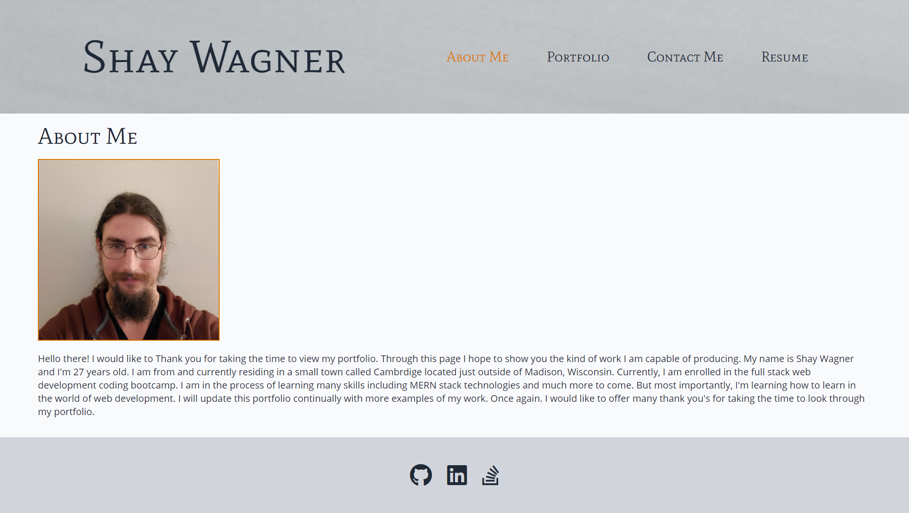
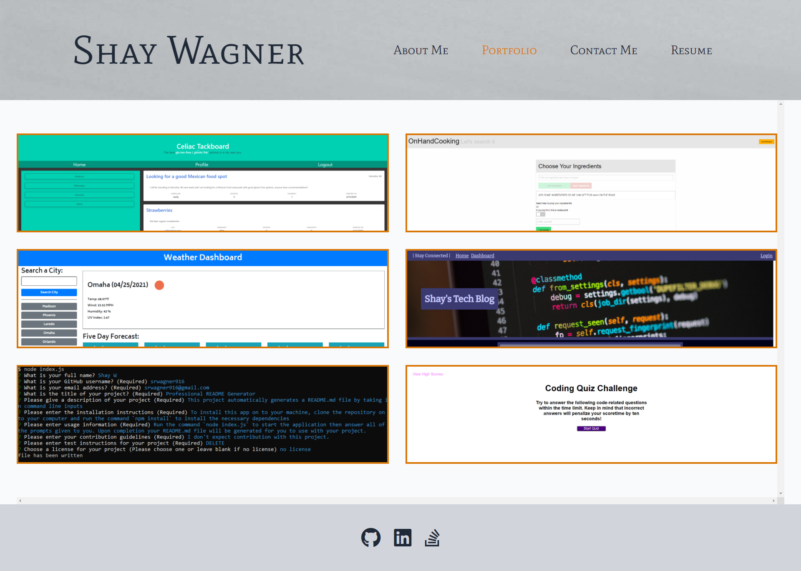
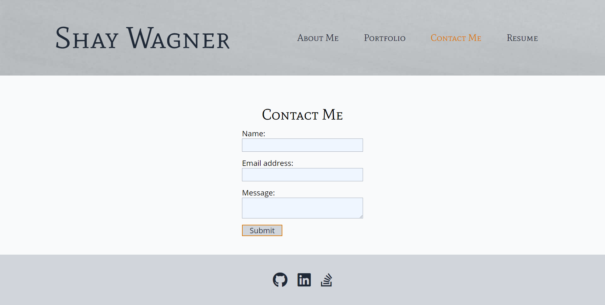
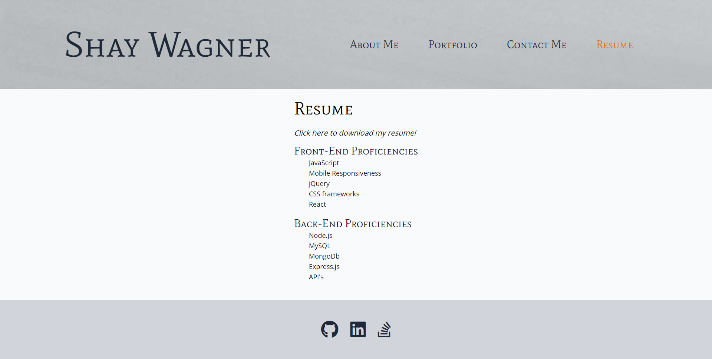

# Portfolio

## Description
This is a current portfolio of my work. It contains the following sections; about me, portfolio, contact me, and resume. Thank you for taking the time to check out some of my projects. The portfolio was made using create react app. I used tailwind CSS as my styling framework. This is my first experience using tailwind. You can find a link to their website [here](https://tailwindcss.com/). Thank you again for taking the time to check this out.
## Table of Contents
  * [Installation](#Installation)
  * [Usage](#Usage)
  * [Contact](#Questions)
## Installation
To install this application to your local machine, click on the green button marked 'Code'. Then copy the link by clicking on the clipboard icon. Then, on your machine navigate to where you want to clone the repo. Once there run the command `git clone <link you copied to your clipboard>`. You will then have the repository cloned onto your local machine. The app is also deployed on GitHub pages. [It can be found by clicking here](https://srwagner916.github.io/react-portfolio/).
## Usage
At the deployed site. You will first see a page marked 'About Me'. Here you will see a short biography along with an image of me. If you click on 'Portfolio' in the header, you will then see some boxes with images of some of my projects. If you hover over an image you will then see the title of the project and the topic it demonstrates. If you click on the title you will be taken to the deployed application. If you click on the GitHub logo next to the title, you will be taken to the GitHub repository. If you click on 'Contact Me' in the header, you will then see a form for filling out messages. If you click on 'Resume' in the header, you will then see a lift of my proficiencies. You will also find a link you can click to download a pdf copy of my resume.

## Questions
GitHub: srwagner916 
Email: <srwagner916@gmail.com>
